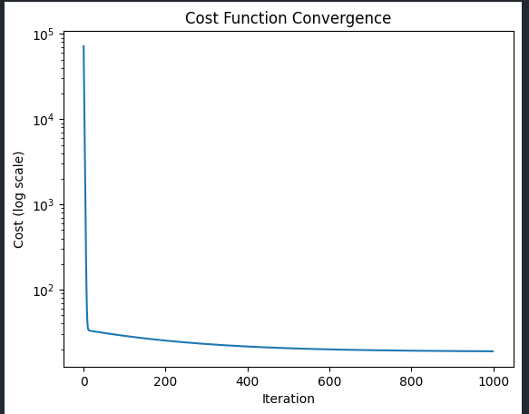
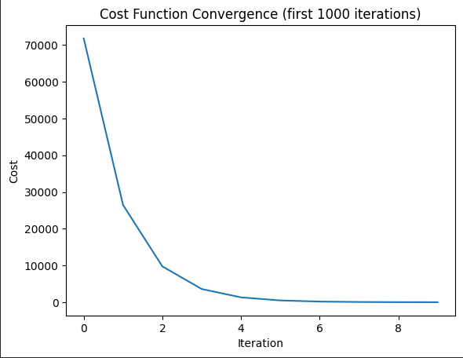

# Linear Regression from Scratch
Linear regression with gradient descent implemented **from scratch** in Python — no scikit-learn for the core algorithm.

This project demonstrates a deep understanding of the math behind machine learning, not just library usage.

---

## Project Goal

Build a working linear regression model using only NumPy, implementing:

- **Cost function** (Mean Squared Error)
- **Gradient calculation** (partial derivatives dJ/dw and dJ/db)
- **Gradient descent** optimization loop
- **Cost convergence** tracking and visualization

---

## The Math

**Model:**

$$\hat{y} = wx + b$$

**Cost function (MSE):**

$$J(w, b) = \frac{1}{2m} \sum_{i=1}^{m} (\hat{y}_i - y_i)^2$$

**Gradients:**

$$\frac{\partial J}{\partial w} = \frac{1}{m} \sum_{i=1}^{m} (\hat{y}_i - y_i) \cdot x_i$$

$$\frac{\partial J}{\partial b} = \frac{1}{m} \sum_{i=1}^{m} (\hat{y}_i - y_i)$$

**Parameter update:**

$$w = w - \alpha \cdot \frac{\partial J}{\partial w}$$

$$b = b - \alpha \cdot \frac{\partial J}{\partial b}$$

Where **α** is the learning rate and **m** is the number of training examples.

---

## Project Structure

```
linear-regression-from-scratch/
|
|--- src/
|   |--- gradient_descent.py      # Core algorithm + CLI interface
|--- source/
|   |--- sample.csv               # Example dataset (x, y columns)
|--- out/
|   |--- cost_history.csv         # Generated: cost per iteration
|--- notebooks/
|   |--- plot.ipynb               # Visualizations (convergence plots)
|--- img/
|   |--- plot.png
|   |--- plotn.png
|--- requirements.txt
|--- LICENSE                      # MIT
|--- README.md
```

---

## Quick Start

### 1. Clone & install

```bash
git clone https://github.com/OlivierGawronek/linear-regression-from-scratch.git
cd linear-regression-from-scratch
pip install -r requirements.txt
```

### 2. Run gradient descent

```bash
python src/gradient_descent.py
```

The program will:
1. Load training data from `source/sample.csv`
2. Ask you for hyperparameters (or use defaults):
   - **Initial w** (default: 0)
   - **Initial b** (default: 0)
   - **Learning rate α** (default: 0.01)
   - **Number of iterations** (default: 1000)
3. Run gradient descent and print the final parameters
4. Save cost history to `out/cost_history.csv`

### 3. Example output

```
Loaded 10 data points.
Initial w (default 0): 
Initial b (default 0): 
Learning rate (default 0.01): 
Number of iterations (default 1000): 

Results:
  w: 100.3333
  b: 3.1515
  Final cost: 23.4239
```

### 4. Visualize convergence

Open `notebooks/plot.ipynb` in Jupyter to see:

- **Cost convergence** (log scale) — shows how the algorithm minimizes the error
- **First N iterations** — zoomed view of the steepest descent phase

### Example Plot


### Example N Plot


---

## Sample Dataset

The included `source/sample.csv` contains 10 data points following approximately **y = 100x + 5** with some noise:

| x  | y    |
|----|------|
| 1  | 105  |
| 2  | 198  |
| 3  | 305  |
| 4  | 410  |
| 5  | 495  |
| 6  | 612  |
| 7  | 693  |
| 8  | 805  |
| 9  | 902  |
| 10 | 1010 |

You can replace it with your own CSV file (two columns: feature and target).

---

## Tech Stack

| Tool        | Purpose                          |
|-------------|----------------------------------|
| **Python**  | Core language                    |
| **NumPy**   | Numerical operations             |
| **Pandas**  | CSV data loading                 |
| **Matplotlib** | Cost convergence visualization |
| **Jupyter** | Interactive notebook             |

---

## Key Takeaways

- The **learning rate** is critical — too high causes divergence, too low makes convergence slow
- The **cost function** should decrease monotonically if α is set correctly
- With clean linear data, gradient descent converges to near-perfect parameters
- Using a **log scale** for the cost plot reveals the full convergence curve

---

## License

This project is licensed under the [MIT License](LICENSE).

---

## Author

**Olivier Gawronek** — Applied Computer Science student  
[MyUniversity](https://pbs.edu.pl/en/)  
[GitHub](https://github.com/OlivierGawronek)